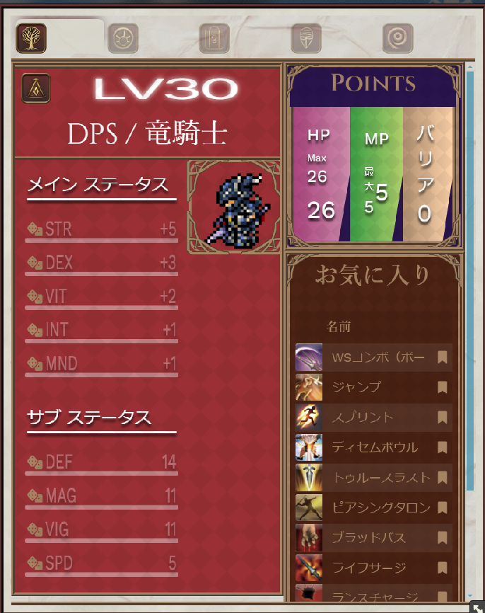
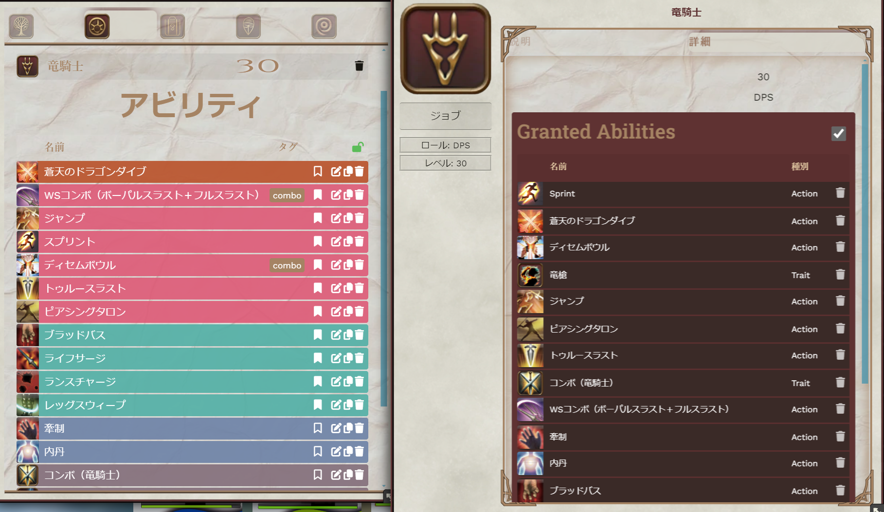
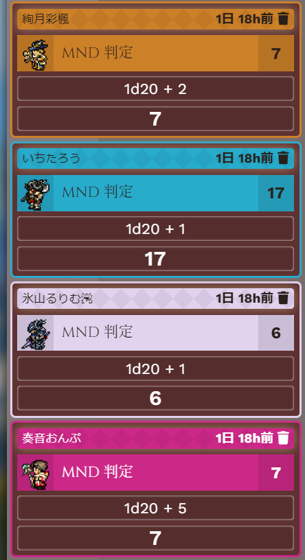
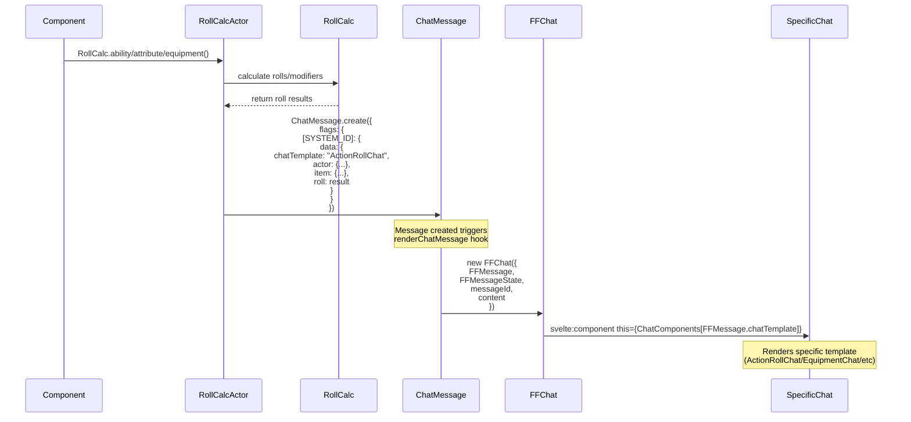

# ファイナルファンタジーTTRPGシステム
Foundry VTTにスクウェア・エニックスのTTRPG『ファイナルファンタジーXIV』のシステム実装したものです。
対象本体バージョンはV12とV13です。

このプロジェクトは、スクウェア・エニックスおよび『ファイナルファンタジーXIV』とは一切関係ありません。すべての商標および著作権は、それぞれの所有者に帰属します。

このシステムは有志のプロジェクトであり、brothersharp (https://www.youtube.com/c/BrotherSharp) からの寄付により @geoidesic によって作成されました。 @geoidesicはFoundryVTTで自分の作品を実現したい人向けに、新しいサービスを立ち上げています：https://aardvark.games

## 支援について
このプロジェクトにはどなたでもコードを提供できます。有志のプロジェクトですので、待てば修正される「公式」ではありません。気になることやお手伝いしたいことがあれば許可の必要なく動いていただければ嬉しいです！

## 中身

- プレイヤーキャラクターおよびNPC用キャラクターシート



- 装備品とインベントリ管理



- イニシアチブ管理を含む戦闘システム
- バフ・デバフ効果と状態異常の管理
- アクションとアビリティの管理
- 技能判定など



## 技術ドキュメント
以下の図は、チャットシステムがロール処理を行いメッセージをレンダリングする方法を示しています。

```mermaid
sequenceDiagram
    participant Component
    participant RollCalcActor
    participant RollCalc
    participant ChatMessage
    participant FFChat
    participant SpecificChat

    Component->>RollCalcActor: RollCalc.ability/attribute/equipment()
    RollCalcActor->>RollCalc: ダイスロール/修正値の計算
    RollCalc-->>RollCalcActor: ロール結果を返す

    RollCalcActor->>ChatMessage: ChatMessage.create({<br/>flags: {<br/>  [SYSTEM_ID]: {<br/>    data: {<br/>      chatTemplate: "ActionRollChat",<br/>      actor: {...},<br/>      item: {...},<br/>      roll: result<br/>    }<br/>  }<br/>})

    Note over ChatMessage: メッセージの作成がrenderChatMessageフックを起動

    ChatMessage->>FFChat: new FFChat({
      FFMessage,
      FFMessageState,
      messageId,
      content
    })

    FFChat->>SpecificChat: svelte:component this={ChatComponents[FFMessage.chatTemplate]}

    Note over SpecificChat: 特定のテンプレートをレンダリングする(ActionRollChat/EquipmentChatなど)
```

## 処理フローの説明

ステータスや所持品などのコンポーネントがRollCalcActorを用いてロールを開始

1. RollCalcActorはRollCalcを使ってダイスロールと計算を処理
2. RollCalcActorは以下の特定のフラグを含むChatMessageを作成:
3. chatTemplate: 使用するチャットコンポーネントを指定
   - actor: アクターデータ
   - item: アイテムデータ（必要な場合）
   - roll: ロール結果
4. ChatMessageを作成するとrenderChatMessageフックが起動
5. フックにより新しいFFChatコンポーネントが作成される
6. FFChatはFFMessage.chatTemplateに基づき、特定のチャットテンプレートを動的にレンダリングする

## インストール

1. マニフェストURLをコピー
2. Foundry VTTを開く
3. ゲームシステムへ移動
4. 「システムをインストール」をクリック
5. マニフェストURLを貼り付ける
6. 「インストール」をクリック

## 開発
このシステムは以下の技術を使用しています：

- コンポーネント管理にSvelte
- Foundry VTTとの統合にTyphonJS
- スタイリングにSASS

開発環境のセットアップ方法：

1. リポジトリをクローンする
2. npm install を実行
3. 開発時は npm run dev を実行
3. 本番ビルドは npm run build:prod を実行

## ライセンス
https://github.com/geoidesic/foundryvtt-final-fantasy-XIV/blob/main/LICENSE
ざっくり解説：
- 自由に共有・配布して良いです。
- 自由に改変して良いです。
- ただし、作者の名前はちゃんと記載してください。
- その他の内容はスクエア・エニックスのコンテンツ利用規約に則ります。


# Final Fantasy TTRPG System for Foundry VTT

A Foundry VTT system implementation for the Square Enix TTRPG Final Fantasy XIV.
Supported Foundry Versions: V12, V13

This system conversion is not affiliated with Square Enix or Final Fantasy XIV. All trademarks and copyrights are property of their respective owners.
This system is a community project that was able to be built by @geoidesic thanks to donations by brothersharp https://www.youtube.com/c/BrotherSharp
@geoidesic is launching a new service for those who would like to see their creations come to life in FoundryVTT: https://aardvark.games

## About this project
This project is entirely maintained through peer support. If you find anything you want to contribute be it in coding or donations please feel free to do so!

## Features

- Character sheets for both Player Characters and NPCs
- Equipment and inventory management
- Combat system with initiative tracking
- Status effects and conditions
- Action and ability management
- Attribute-based skill checks

## Technical Documentation
The following diagram shows how the chat system processes rolls and renders messages:



### Flow Description

1. A component (like Attributes or Inventory) initiates a roll using RollCalcActor
2. RollCalcActor uses RollCalc to handle dice rolls and calculations
3. RollCalcActor creates a ChatMessage with specific flags:
   - chatTemplate: Which specific chat component to use
   - actor: Actor data
   - item: Item data (if relevant)
   - roll: Roll results
4. Creating the ChatMessage triggers the renderChatMessage hook
5. The hook creates a new FFChat component
6. FFChat dynamically renders the specific chat template based on FFMessage.chatTemplate

## Installation

1. Copy the manifest URL
2. Open Foundry VTT
3. Go to Game Systems
4. Click "Install System"
5. Paste the manifest URL
6. Click Install

## Development

This system is built using:
- Svelte for component management
- TyphonJS for Foundry VTT integration
- SASS for styling

To set up the development environment:

1. Clone the repository
2. Run `npm install`
3. Run `npm run dev` for development
4. Run `npm run build:prod` for production build

## License
https://github.com/geoidesic/foundryvtt-final-fantasy-XIV/blob/main/LICENSE
