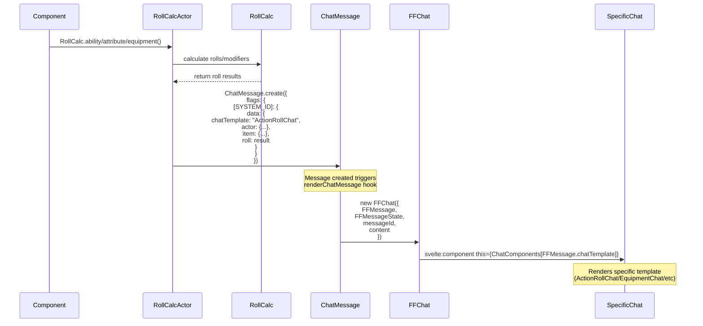

# Final Fantasy TTRPG System for Foundry VTT

A Foundry VTT system implementation for the Square Enix TTRPG Final Fantasy XIV.

## Features

- Character sheets for both Player Characters and NPCs
- Equipment and inventory management
- Combat system with initiative tracking
- Status effects and conditions
- Action and ability management
- Attribute-based skill checks

## Technical Documentation

The following diagram shows how the chat system processes rolls and renders messages:

### Flow Description

1. A component (like Attributes or Inventory) initiates a roll using RollCalcActor
2. RollCalcActor uses RollCalc to handle dice rolls and calculations
3. RollCalcActor creates a ChatMessage with specific flags:
   - chatTemplate: Which specific chat component to use
   - actor: Actor data
   - item: Item data (if relevant)
   - roll: Roll results
4. Creating the ChatMessage triggers the renderChatMessage hook
5. The hook creates a new FFChat component
6. FFChat dynamically renders the specific chat template based on FFMessage.chatTemplate

## Installation

1. Copy the manifest URL
2. Open Foundry VTT
3. Go to Game Systems
4. Click "Install System"
5. Paste the manifest URL
6. Click Install

## Development

This system is built using:
- Svelte for component management
- TyphonJS for Foundry VTT integration
- SASS for styling

To set up the development environment:

1. Clone the repository
2. Run `npm install`
3. Run `npm run dev` for development
4. Run `npm run build` for production build

## License

This project is licensed under [appropriate license].
