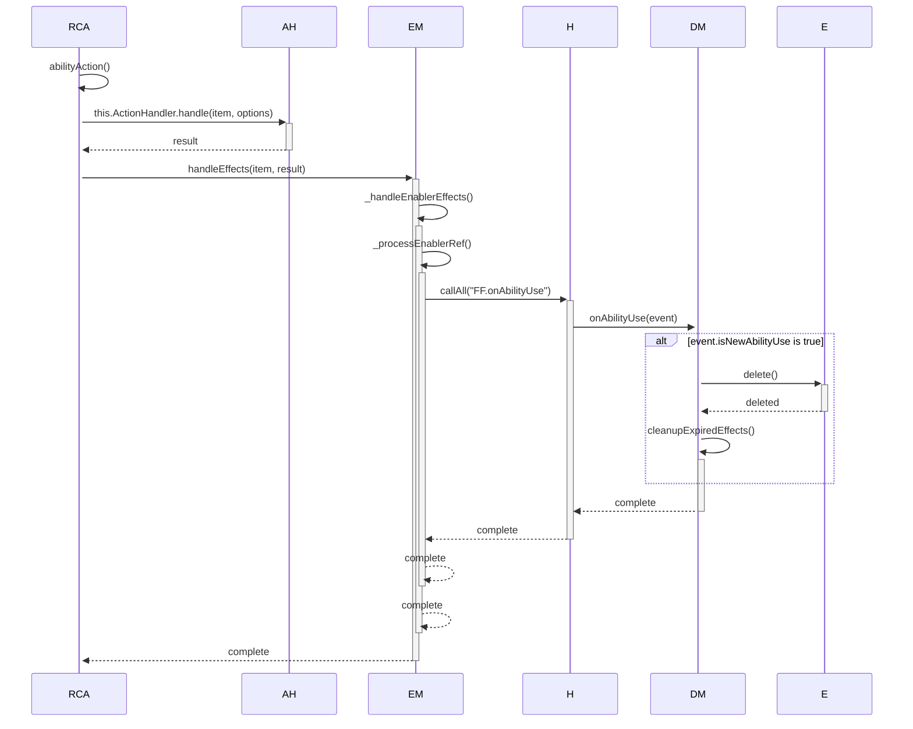

```mermaid
sequenceDiagram
    RCA->>+RCA: abilityAction()
    RCA->>+AH: this.ActionHandler.handle(item, options)
    AH-->>-RCA: result
    RCA->>+EM: handleEffects(item, result)
    EM->>+EM: _handleEnablerEffects()
    EM->>+EM: _processEnablerRef()
    EM->>+H: callAll("FF.onAbilityUse")
    H->>+DM: onAbilityUse(event)
    
    alt event.isNewAbilityUse is true
        DM->>+E: delete()
        E-->>-DM: deleted
        DM->>+DM: cleanupExpiredEffects()
    end
    DM-->>-H: complete
    H-->>-EM: complete
    EM-->>-EM: complete
    EM-->>-EM: complete
    EM-->>-RCA: complete
```

Note: 
- RCA represents RollCalcActor
- EM represents EffectManager
- AH represents ActionHandler
- H represents Hooks
- DM represents DurationManager
- E represents Effect


    
```